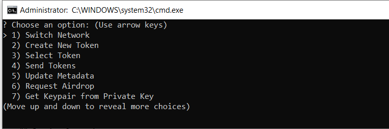

<!-- PROJECT SHIELDS -->
<!--
*** I'm using markdown "reference style" links for readability.
*** Reference links are enclosed in brackets [ ] instead of parentheses ( ).
*** See the bottom of this document for the declaration of the reference variables
*** for contributors-url, forks-url, etc. This is an optional, concise syntax you may use.
*** https://www.markdownguide.org/basic-syntax/#reference-style-links
-->
[![Contributors][contributors-shield]][contributors-url]
[![Forks][forks-shield]][forks-url]
[![Stargazers][stars-shield]][stars-url]
[![Issues][issues-shield]][issues-url]
[![MIT License][license-shield]][license-url]
[![LinkedIn][linkedin-shield]][linkedin-url]


<!-- PROJECT LOGO -->
<br />
<p align="center">
  <!--   <a href="https://github.com/EvanGottschalk/TokenTools">
    
  </a> -->
  <a href="https://github.com/EvanGottschalk/TokenTools">
    
  </a>

  <h3 align="center">TokenTools</h3>

  <p align="center">
    A simple command line interface for interacting with tokens on Solana.
    <br />
    <a href="https://github.com/EvanGottschalk/TokenTools"><strong>Explore the docs »</strong></a>
    <br />
    <br />
    <a href="https://github.com/EvanGottschalk/TokenTools">View Demo</a>
    ·
    <a href="https://github.com/EvanGottschalk/TokenTools/issues">Report Bug</a>
    ·
    <a href="https://github.com/EvanGottschalk/TokenTools/issues">Request Feature</a>
  </p>
</p>


<br>


<!-- TABLE OF CONTENTS -->
<details open="open">
  <summary><h2 style="display: inline-block">Table of Contents</h2></summary>
  <ol>
    <li>
      <a href="#about-the-project">About The Project</a>
      <ul>
        <li><a href="#built-with">Built With</a></li>
      </ul>
    </li>
    <li>
      <a href="#getting-started">Getting Started</a>
      <ul>
        <li><a href="#prerequisites">Prerequisites</a></li>
        <li><a href="#installation">Installation</a></li>
      </ul>
    </li>
    <li><a href="#usage">Usage</a></li>
    <li><a href="#roadmap">Roadmap</a></li>
    <li><a href="#contributing">Contributing</a></li>
    <li><a href="#license">License</a></li>
    <li><a href="#contact">Contact</a></li>
    <li><a href="#acknowledgements">Acknowledgements</a></li>
  </ol>
</details>


<br>


<!-- ABOUT THE PROJECT -->
## About The Project

`TokenTools` is a simple command line interface for interacting with tokens on Solana.

All tokens on Solana are known as SPL tokens. You can use `TokenTools` to create new tokens, modify tokens, transfer tokens and beyond.

<a href="https://github.com/EvanGottschalk/TokenTools">
  
</a>


<br>


### Built With

* [MetaBoss](https://metaboss.rs/) - this amazing library provides functions for creating and interacting with SPL tokens
* [@solana/web3.js](https://solana-labs.github.io/solana-web3.js/) - this library provides fundamental tools for interacting with the Solana blockchain


<br>


<!-- GETTING STARTED -->
## Getting Started

To get a local copy up and running follow these simple steps.


<br>


### Prerequisites

`TokenTools` requires Node version 18.19.0 or later.


<br>


### Installation

1. Clone this repository
   ```
   git clone https://github.com/EvanGottschalk/TokenTools
   ```
2. Initialize a new Node project
   ```
   yarn init
   ```
3. Install necessary dependencies
   ```
   yarn install
   ```
4. Install Metaboss
   ```
   yarn install metaboss
   ```
5. Run the program
   ```
   npx run scripts/TokenTools.js
   ```


<br>


<!-- USAGE EXAMPLES -->
## Usage

After getting the program running, you can use a test wallet address, or the address from your web wallet. To use your web wallet, first get the private key, and then derive the keypair array using `TokenTools`

Once you have your keypair file, you are ready to go! `TokenTools` can be used to mint NFTs and fungible tokens on Solana's mainnet and devnet.

On devnet, you can use `TokenTools` to request an airdrop and start minting!

On mainnet, you will have to first deposit some SOL into your wallet before you can start minting with `TokenTools`.


<br>


<!-- ROADMAP -->
## Roadmap

See the [open issues](https://github.com/EvanGottschalk/TokenTools/issues) for a list of proposed features (and known issues).

### Upcoming Features

* Batch transfers
* NFT tools
* DEX interactivity


<br>


<!-- CONTRIBUTING -->
## Contributing

Contributions are what make the open source community such an amazing place to be learn, inspire, and create. Any contributions you make are **greatly appreciated**.

1. Fork the Project
2. Create your Feature Branch (`git checkout -b feature/AmazingFeature`)
3. Commit your Changes (`git commit -m 'Add some AmazingFeature'`)
4. Push to the Branch (`git push origin feature/AmazingFeature`)
5. Open a Pull Request


<br>


<!-- LICENSE -->
## License

Distributed under the GNU GPL-3 License. See `LICENSE` for more information.


<br>


<!-- CONTACT -->
## Contact

Evan Gottschalk - [@EvanOnEarth_eth](https://twitter.com/EvanOnEarth_eth) - evan.blockchain@gmail.com

Project Link: [https://github.com/EvanGottschalk/TokenTools](https://github.com/EvanGottschalk/TokenTools)


<br>


<!-- ACKNOWLEDGEMENTS -->
## Acknowledgements

Thinking about contributing to this project? Please do! Your Github username will then appear here.


<!-- MARKDOWN LINKS & IMAGES -->
<!-- https://www.markdownguide.org/basic-syntax/#reference-style-links -->
[contributors-shield]: https://img.shields.io/github/contributors/EvanGottschalk/TokenTools.svg?style=for-the-badge
[contributors-url]: https://github.com/EvanGottschalk/TokenTools/graphs/contributors
[forks-shield]: https://img.shields.io/github/forks/EvanGottschalk/TokenTools.svg?style=for-the-badge
[forks-url]: https://github.com/EvanGottschalk/TokenTools/network/members
[stars-shield]: https://img.shields.io/github/stars/EvanGottschalk/TokenTools.svg?style=for-the-badge
[stars-url]: https://github.com/EvanGottschalk/TokenTools/stargazers
[issues-shield]: https://img.shields.io/github/issues/EvanGottschalk/TokenTools.svg?style=for-the-badge
[issues-url]: https://github.com/EvanGottschalk/TokenTools/issues
[license-shield]: https://img.shields.io/github/license/EvanGottschalk/TokenTools.svg?style=for-the-badge
[license-url]: https://github.com/EvanGottschalk/TokenTools/blob/master/LICENSE.txt
[linkedin-shield]: https://img.shields.io/badge/-LinkedIn-black.svg?style=for-the-badge&logo=linkedin&colorB=555
[linkedin-url]: https://linkedin.com/in/EvanGottschalk
